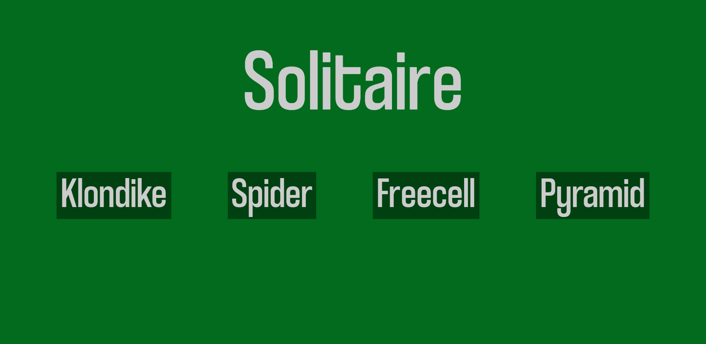
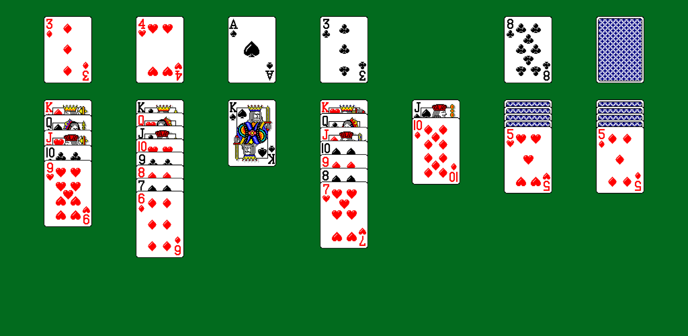
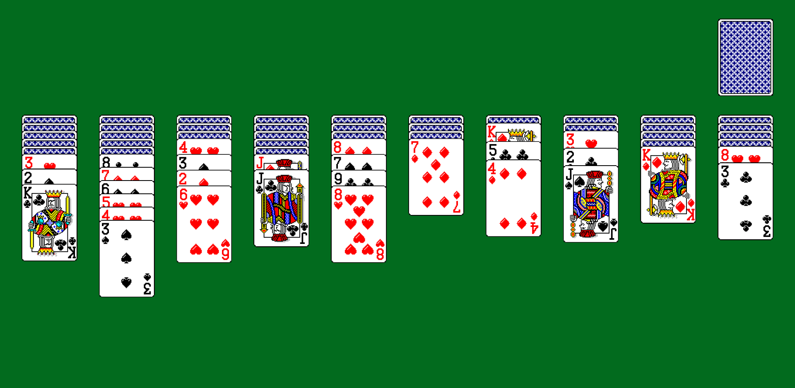
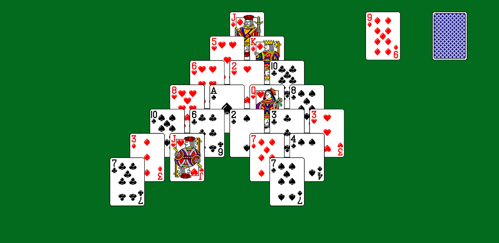

# Solitaire
## Features
* Solution guaranteed game generation algorithm
* Undo and redo
* Fast-play
* Auto-solve
* Games:
    * Klondike
    * Spider
    * Freecell
    * Pyramid

## To Do List
* Sound effects

## What I Learned
* Data structures
* Canvas in HTML
* JavaScript

## [Play](https://erendn.github.io/solitaire-js/)

## Screenshots

